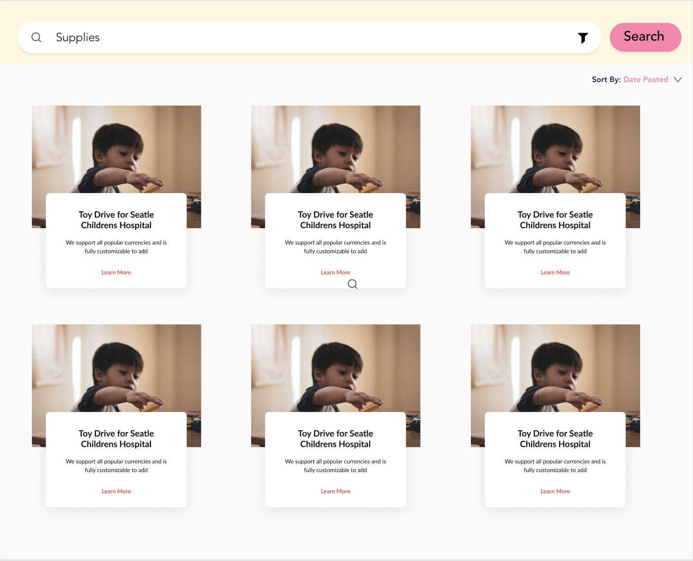

## Logo

## Problem
#### Problem description:
During this COVID-19 there are shortages of masks, gloves, food, and other essential supplies for healthcare workers. There is no platform where individuals or small businesses can start a campaign to support frontline healthcare workers and hospitals. Many of those who want to contribute either can’t leave their homes, don’t know how to help, and want to make a difference in their own communities.

#### Problem statement:
How might local seattleite donors increase donation quantity and quality to health care professionals in order to show recognition and gratitude to local healthcare workers.

#### Solution
_**Overall Goal:**_   
Our solution is creating a website that connects those who want to donate to local health care workers through a crowd campaign site. This can include anything from collecting surgical masks and then donating them to a local hospital, or collecting funds for x cause.  
**Specific Solution**
- In essence while our problem can span to the entire world, at this time we want to focus locally to our own city of seattle. This means a concentration on local medical professionals and needs as well as following local laws and guidelines.    
- Our specific solution for this project involves creating a webpage that allows the set up and viewing of available and ongoing campaigns in the city of seattle, wa.    
    - Donor POV:  
      - selecting / viewing the campaign
      -  Connecting with a campaign
      - Instructions for pick up/drop off    
    - Med POV:
      - Creating Campaign  
      - Instructions for collection  

#### Design
     
**Landing page:**  
We keep our landing site as simple and straightforward as possible. There are two options on our landing page: to create a campaign or to browse campaigns.   
**Create campaign 1:**
   
When a user selects to create a campaign, the first page they will see is ‘what type of campaign’. We want to group and organize all the campaigns through clear categories so they are easy to find.   
**Create campaign 2:**
   
Then we ask the title of the campaign. It’s mandatory for everyone to write a short and focused title of their campaign.   
**Create campaign 3:**
   
They need to write and explain what the campaign is about, that includes the purpose of the campaign itself. When people click the campaign, they need to understand what the campaign is all about.   
**Create campaign 4:**
   
This is the last page if they want to add more information such as location, contact information, and also photos. We encourage everyone to include photos.   
**Search for a campaign**
   
On the donors end they are able to search and use filters to find campaigns they can support.   
**View campaign details**
   
If they select on a campaign they are able to click and see more details and go through the process of connecting with the campaign
