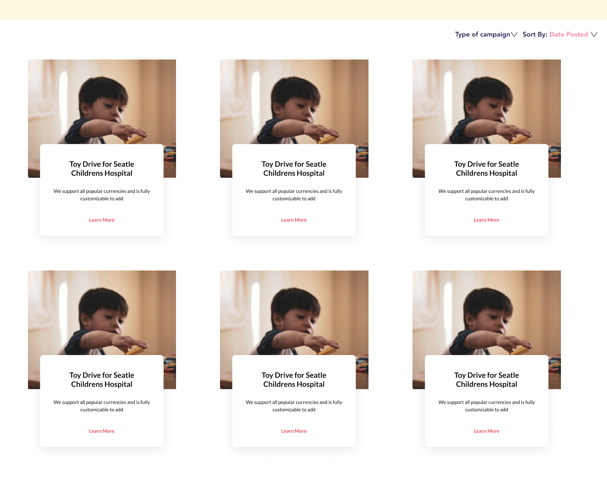

### Requirements - Donaid

#### Accessibility
- All images will include alternate text
- Text will be tagged as H1, h2, body text, etc. respectively
- Color contrast will be WCAG double AA compliance meaning a contrast ratio of at least 4:5:1

#### Top Nav Bar (Same across pages unless otherwise stated)
- Aligned to the left side of the bar in order:
   - Clicking on Logo image links to home page
   - 2 tabs in this order: About, Organizations
- Aligned to the right
   - Create campaign button: links to create a campaign page

#### Landing page
- Reference **image 1**
- Include Top nav bar
- Section one
    - High resolution hero image min 1280x1084
    - “Learn more” button linking to about page
- Section two
    - Two cards:
        - The titles of the cards are H2 titles “Create Campaign”  and “Browse Campaigns” respectively
        - 1 image and 1 description of 200 max char per card
        - 1 button to respective a"ction (browse or create)

- Section three
    - “Contact Us” title H1
    - Include social media platform via icons
    - “Donaid Co.” text in line
    - And all rights reserved

#### Create a campaign page
- Include Top nav bar
- Each of the following sections is a full page, that requires a next button to confirm input and move on to the next section page.
- Section one
    - Select type of campaigns from a minimum of 4 categories viewed as buttons. Reference **image 2** for button layout
    - Each button will link to respective category page
- Section two
    - A text box for the title of the campaign with a maximum of 30 characters. We want to keep the title short, but also meaningful.
- Section three
    - Insert campaign description
      - No char limit
      - The field will be a Text input, allowing lists, and disallowing media input.
- Section four: **image 5**
    - 3 optional form text fields that allows users to input information including location, contact, email, .
    - 1 optional Media input field for: photos, videos
      - Card with a photo icon and an upload button that prompts a computer file selector.
    - This sections will substitute the next button with a complete button and direct the user to the recently created campaign page

#### Browse campaigns page (**Image 6**)
- Include Top nav bar
- Section one
    - Filter campaigns available drop down button
      - Filter by: campaign type options: money, supplies, human resources
    - Sort action button
      - Sort by: alphabetical order, date created
- Section two
    - View campaign result cards
      - View an array of results at least 3 per row
      - On each results card view: name, and 200 max char description and button to view more details
         - More details button directs to campaign page

#### Campaign page
- Top nav
- Section one In order
    - Section 1.1
      - Campaign name in distinct Header 1 title text
      - Campaign summary description text
      - Author title
    - Section 1.2 right aligned to section 1.1
      - Use one provided or provide a general health care image
      - View of current donations status/progress in view as a progress bar with 0 on the left and the goal number on the right of the bar
- Section two In order
    - Campaign description text exact to text in **image 7**
    - Campaign media picture aligned to right and inserted using image tag
- Section three
    - Pledge action button (Not shown in the wireframe images)
      - Clicking prompts a modal
      - The H1 for the modal reads “How much do you pledge to donate?”
      - Below is an input text field for the amount and a confirm action button
      - Clicking the action button increases the pledged amount on the campaign progress bar by the amount inputted

**image 1:**

 

**image 2:**
  

**image 3:**
  

**image 4:**
  

**image 5:**
  

**image 6:**
  

**image 7:**

