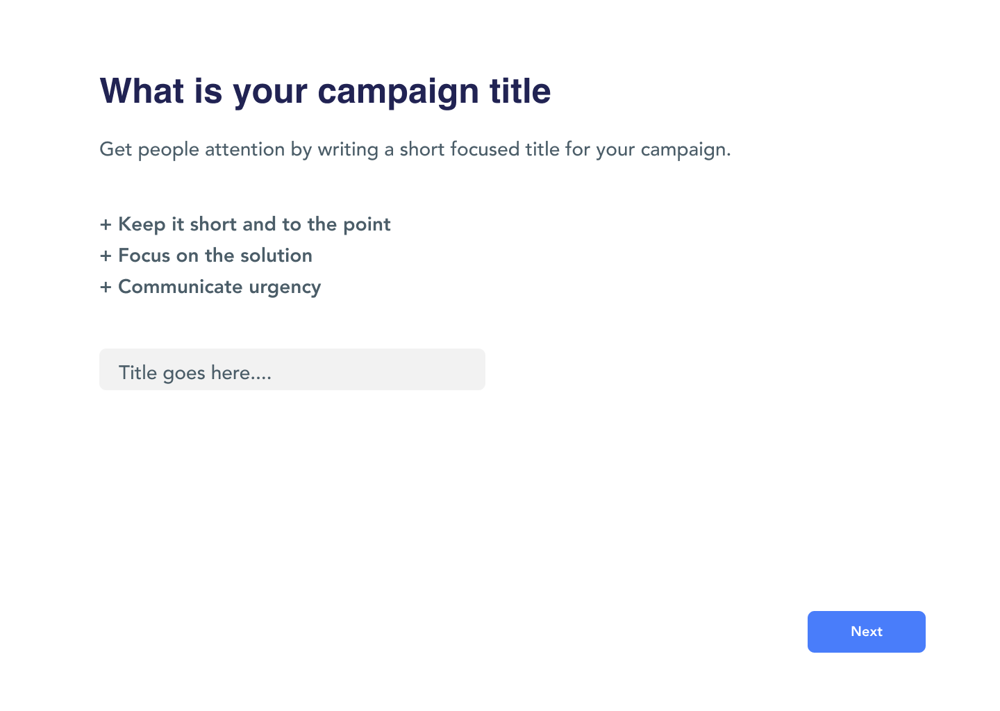
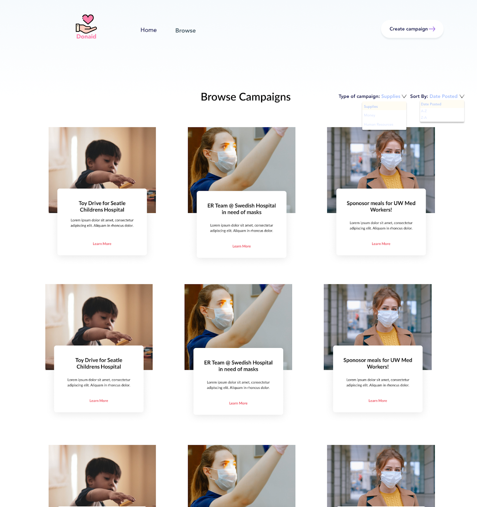

### Requirements - Donaid

#### Accessibility
- All images will include alternate text
- Text will be tagged as H1, H2, body text, etc. respectively
- Color contrast will be WCAG double AA compliance meaning a contrast ratio of at least 4:5:1
- Our target devices are desktop screens. Mobile responsiveness is not a priority for the scope of this project

#### Landing page (Reference Image 1)
- The landing page will contain the “Top Nav Bar” which contains navigation to pages specific in Top Nav Bar section below
- Section one
    - The hero image will be high resolution with min 1280x1084.
    - The landing page will contain two cards, “Create Campaign” and “Browse Campaigns”.
    - The titles of the cards will be H2 titles, “Create Campaign”  and “Browse Campaigns” respectively.
    - Each of the cards will contain 1 descriptive image.
    - Each of the cards will contain 1 description text of 200 max char.
    - Each of the cards will contain 1 button to the respective action. (browse or create)
- Section Two [Footer] reference **image 9**
    - Aligned to the let of the footer
        - This footer Includes a non clickable Donaid logo image
        - Below is non clickable text of Seattle, WA and an all Rights reserved text
    - Aligned to the right of the footer is the donaid email, donaid phone number and below three social media account buttons
        - Facebook icon linking to facebook.com
        - Twitter icon linking to twitter.com
        - Linkedin icon linking to linkedin.com

#### Top Nav Bar (Same across pages unless otherwise stated)
- Aligned to the left side of the bar in order:
  - The Logo image will route the user to the home page when the user clicks on it.
  - The navigation tabs will contain “Home” and “Browse” in order.
- Aligned to the right
  - The “Create Campaign” button will route the user to the “Create a Campaign” page.

#### Create a campaign page
- The “Create a Campaign” page will include the Top nav bar.
- Each of the following sections will be a full page.
- “What Type of Campaign” Section: **image 2**
  - 3 categories of campaigns, “Money”,”Supplies” and “Human Resource” will be presented as buttons to allow user selection. Reference **image 2** for button layout.
  - Each button will route the user to the respective category page.
  - The “Next” button will confirm input and move on to the next section page.
  - Error Handling: if the next button is clicked and required fields are empty the page will reload and the “Required” text and asterisks will turn red.
- “What is Your Campaign Title” Section: **image 3**
  - There will be an H1 header with the text ”What type of Campaign?”
  - The list and description in image 3 is not clickable and only text
  - Below is a text box field with a maximum of 30 characters inputted.
  - The “Next” button will confirm input and move on to the next section page.
  - Error Handling: if the next button is clicked and required fields are empty the page will reload and the “Required” text and asterisks will turn red.
- “Explain the Purpose of the Campaign” Section: **image 4**
  - Insert campaign description
    - The text input box of campaign description will have no char limit.
    - The text input box of campaign description will allow lists.
    - The text input box of campaign description will not allow media input.
  - Insert Campaign goal
    - The text input box will take in any number
    - The “Next” button will confirm input and move on to the next section page.
    - Error Handling: if the next button is clicked and required fields are empty the page will reload and the “Required” text and asterisks will turn red.
  - “Add Details” Section: **image 5**
    - The 3 form text fields will allow users to input information including location, email and phone number.
    - Uploading photos and videos in the Media input field will be optional.
    - The background of the Media input field will be a photo icon.
    - The Media input field will contain an upload button that prompts a computer file selector.
    - The “Submit” button will direct the user to the recently created campaign page
    - Error Handling: if the submit button is clicked and required fields are empty the page will reload and the “Required” text and asterisks will turn red.

#### Browse campaigns page (**Image 6**)
- The “Browse Campaigns” Page will include Top nav bar.
- Section one
  - The drop down button next to “Type of campaign:” will allow users to filter campaigns available.
  - The filter options are campaign type options: money, supplies, human resources.
  - The drop down button next to “Sort By:” will allow users to sort campaigns available.
  - User will be able to sort campaigns by alphabetical order and date posted.
- Section two
  - View campaign result cards
    - The campaigns will be displayed in cards.
    - There will be 3 cards per row when the cards are displayed.
    - Each campaign card will include the campaign name.
    - Each campaign card will include a description text with 200 max char.
    - Each campaign card will include a “Learn more” button for user to view more details.
    - The “Learn more” button will route user to the corresponding campaign page.

#### Campaign page (**Image 7**)
- The Campaign Page will include the top nav bar.
- Section one In order
  - Section 1.1
    - The Campaign page will include the image uploaded from the user in Create a Campaign page Add Details section will be displayed.
    - If a user did not upload an image, a static general health care image will be displayed.
  - Section 1.2 left aligned to section 1.1
    - The view of current donations status/progress in view as a progress bar with 0 on the left and the goal number on the right of the bar.
    - Pledge action button
      - Button has text “Support”
- Section two
  - Section 2.1
    - The Campaign page will include the name of the campaign as a H1 title text.
    - The Campaign page will include a summary description text of the campaign.
  - Section 2.2 right aligned to section 2.1
    - Information about user, name as H2 text, title, body text
- Section three: Image 8 popup
  - One the donate button is clicked a window pops out to ask users to input how many items they're going to donate and the user's email address. **Image 8**
    - Clicking the submit action button increases the pledged amount on the campaign progress bar by the amount inputted

**image 1:**

 

**image 2:**
  

**image 3:**
  

**image 4:**
  

**image 5:**
  

**image 6:**
  

**image 7:**

**image 8:**

**image 9:**

