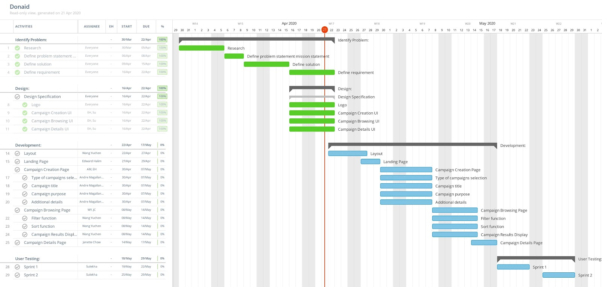

## Planning
Now that you've translated your design into requirements, and your requirements into an architecture, it's time to plan how you're going to work together to build your application.
Write a GitHub page that answers the following questions:
To make a good plan, brainstorm disasters that might happen and test your plan against them. Illness, injury, API limitations, difficult to fix bugs: how resilient is your plan to all of these crises?
1. Coordinating Work
  - Janette our PM will coordinate the work and  is using a Gantt Chart to manage assigned tasks to track who is responsible for each component and by the milestone it needs to be completed by. You can view the image below for specific details.
  
  - We will meet during class time on Mondays and Wednesdays up until 10:30 am. as well as our Tuesday meetings at 4 pm to 5:30 pm as agreed upon in our team charter. We do not expect everyone to meet outside of these times, however are open to scheduling time outside of our scheduled team meetings where the entire team is  not required or expected to show up. Only those who agreed to the new meeting.
  - During our meetings the expectation is to work on the assigned HW and or writing the code for the component that person is responsible for.
  - Each meeting we will check on the progress each member has made to their component as well as other relevant work specific in section 3 of this document.

2. Communication
  - We utilize facebook messenger as our main messaging and communication tool as well as zoom for our live “face to face meetings”. Messenger is usually used for quick questions and zoom is mainly used when we are working on a deliverable or assigning work. Slack would likely be an alternative but facebook messenger was the easier option as it was more convenient for everyone in the group.   
3. Who will own components in your architecture?
  - For each component, list the one person who is in charge of getting it done.
|component           |Name
|---                 |---
|Header.js           |Yuchen Wang
|LandingPage.js      |Edward Halim
|CampaignType.js     |Edward Halim
|CampaignTitle.js    |Edward Halim
|CampaignPurpose.js  |Edward Halim
|CampaignDetails.js  |Edward Halim
|CampaignBrowsing.js |Yuchen Wang
|Campaign.js         |Yuchen Wang
|Footer.js           |Yuchen Wang

4. MIlestones and Timelines     
|Milestones                     |Deadlines
|---                            |---
|Create React app layout        |04/27/2020
|Create Landing Page            |04/29/2020
|Create campaign type Selection |05/07/2020
|Create campaign purpose input field  |05/07/2020
|Create campaign title input field  |05/07/2020
|Create input form for additional details |05/07/2020
|Create Campaigns display cards |05/14/2020
|Implement Sort feature |05/14/2020
|Implement Filter feature |05/14/2020
|Create Campaign details page   |05/17/2020

5. Requirement Verification
  - Functional Testing Logistics
    - All code will be tested by the owner of the owner prior to making any push.
      - If the code contains errors they will be commented in the code prior to committing to the repository.
    - Additionally quality tests will be done by the owner and one other team member.
      - Who that other team member is, is up to the discretion of the owner.
      - If the test contains no errors as detailed in the respective section by both the owner and the second team members test  then the page is checked as Verified Complete on our Gantt Chart.
      - If the test contains errors then comment the error and a suggested solution in code, message the owner of the error, and the process returns to step (i) until step (2) is met.
    - These tests aim to verify functionality within the components in our website.
  - Functional Tests
    - Accessibility
      - To check web accessibility we will utilize the Wave chrome extension. The key metrics we will look at are the following:
        - To pass all AA requirements on the contrast tab for each page
        - No “missing alternative text” error in the Errors tab for each page with an image
        - For each page tagging will be checked by visually matching the respective heading tag to the heading specified in the requirement
    - Top Nav Bar (Same across pages unless otherwise stated)
      - The nav bar contains buttons that direct users to their respective pages.
      - The test will include:
        - Verifying that each button directs to the respective page detailed in the requirements document by clicking the button and following the link.
    - Landing Page
      - The landing page will consist of multiple points of navigation so we will propose a test to verify that each button works correctly and redirects to the correct page.
      - The test will include the following
        - visually checking all text and headers for improper grammar and spelling
        - Clicking on all links and buttons and verifying that they are routed to the specified site in the requirement.
          - EX: create campaign button links to create campaign page, facebook icon links to facebook.com.
    - Create  a Campaign pages
      - These pages consist of inputted user data and error handling to make sure that the required information was inputted or selected
      - The test will include
        - Writing error handling tests that make sure that the text entries are the correct format(email, phone number, location etc)
          - The email text entry box requires an email address, the test would check to make sure an email address is entered which typically includes a "name@domain.xxx" format (@ a domain and .com, .org, .edu) etc.
          - The phone number text entry box requires a phone number, the test would check to make sure a phone number is entered and that just integers and no characters or symbols are entered, and it would check for a phone number format
          - The add photos would check to only accept image  files such as jpg, png, jpeg, gif etc.
          - The location test would check for ensuring that an actual city/state location is entered
          - The campaign title text entry test would ensure that the entered text is at a minimum 5 characters and a maximum 60 characters
          - The explain the purpose of the campaign page test would include checking to make sure a minimum 50 characters are written
        - All the pages on the create a campaign page include required information that requires response, if no input is given or selected an error will be thrown
          - The type of campaign page test would include ensuring that a campaign type is selected or an error will be thrown stating that this is required information
    - Campaign Page
      - The campaign page presents the user with information on a requested campaign.
      - The test will include
        - Reviewing that all buttons on the page link to the required action as outlined on the requirements spec
        - Checking that content displayed on the page is consistent with the content inputted and uploaded by the user in the Create a Campaign pages
        - Test that the donate modal and button increases the donation count on the progress by only one.
    - Browse Campaigns Page
      - The browse campaign page consists of different campaigns listed that users can filter through and selected
      - The test will include
        - ensuring that the filters work correctly
          1. If a user were to select a type of campaign(supplies, money, hr, etc.) the appropriate campaigns that fit the type selected would be displayed
          2. If not campaign type is selected all campaigns of all types are displayed
          - If a user were to select a sorting option, the campaigns would be displayed in the selected order(by date posted, a-z, or z-a), if no sorting option is selected the default would be to display in alphabetical order
        - Ensuring that the navigation works correctly
          - If a user were to click on a campaign it should redirect them to that specific campaigns “campaign page”
6. Mitigation Plan  
    In the case of a disaster we have planned ways to mitigate these and keep the team moving towards our end product goal.
    In the case of illness or injury we will have specific team members fill in for one another.
    - Roles Emergency Response
      1. In the case that our PM Janette is unable to fulfill her role or work, Andre the CEO will take over the role
      2. In the case that our CTO Yuchen is unable to fulfill his role or work, Janette the PM would fulfill this role as after Yuchen she has more technical skills than the other members
      3. In the case that our CDO’s Sulekha and Edward are unable to fulfill their role or work, because we have two CDO’s on the team our initial response in the case that one of them is not available would be to see if the other would be able to fulfill the work of the other in the case of disaster, illness, injury, etc.
      4. In the case that our CEO Andre is unable to fulfill his role, CDO Sulekha  would fulfill this role
    - Taking over a role includes:
      1. reviewing that person's previous work found in the google drive
      2. Taking ownership and responsibility for overall completion and success of newly acquired role
      3. Delegating and distributing workload evenly across other team members while still maintaining overall responsibility
    - Technical Constraints
      - In terms of difficult to fix bugs our plan includes an organized checklist of steps in the following order:
        1. Utilizing online resources such as stack overflow and other online communities
        2. Message the team of the problem and seek technical assistance
        3. Post a clear description of the issue being faced on slack with a snippet of relevant code asking for classmates assistance
        4. Ask the TA for assistance and give access to Github repository as well as the previous code used in step C
        5. Ask the Professor for assistance give access to Github repository as well as the previous code used in step C and any updates from step D
        6. If we are unable to overcome this bug, the milestone is not met and more than 2 days overdue:
          - We would first measure the implications and effects of removing this code as outlined in our Architecture file.
          - Then we would consider removing the requirement that may be causing this bug with the approval and agreement of both the  CTO Yuchen and PM Janette
            - In the case of a disagreement the CEO Andre will make the decision
      - In terms of API limitations we wouldn’t have to account for this as we don’t have API’s
    - Proactive Steps
      - All work is submitted and uploaded to the team Google drive and all code is pushed to the teams Github repository
        - This allows someone from a different role to review the work of another role
      - Weekly check ins on status of work
        - This keeps all members informed of issues and progress to the milestones
      - Gantt chart and Mitigation plan
        - Outlines our responsibilities and addresses the worst case scenario of having a member unable to contribute
      - Health
        - Responsible health practices including following the WHO, CDC, and HHS, and State guidelines for coronavirus
